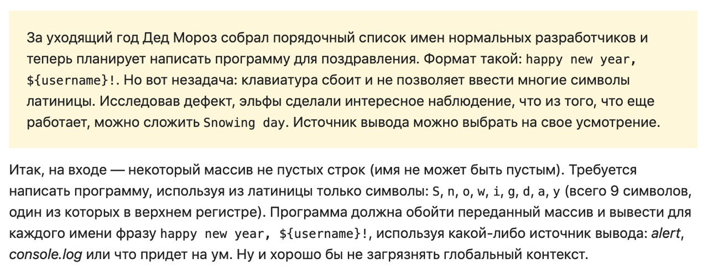

# Новогодняя задачка
Условие задачи:
 

Дед Мороз и эльфы использовали возможность JS интерпретировать 
в строке восьмеричные кодовые символы и динамически выполнять код 
через `eval()`. Они использовали только одну переменную `window` (слово, 
которое можно составить из букв по условию задачи), и написали текст 
программы в восьмеричном виде. И еще успели разложить подарки под елки 
к утру;) 

Для того, чтобы увидеть поздравления Деда Мороза, нужно открыть `Snowingday.html`.

Так же на случай внезапных сбоев клавиатуры эльфы написали Деду Морозу 
конвертер кода по этой методике (`converter.html`).
## Happy New Year!!!